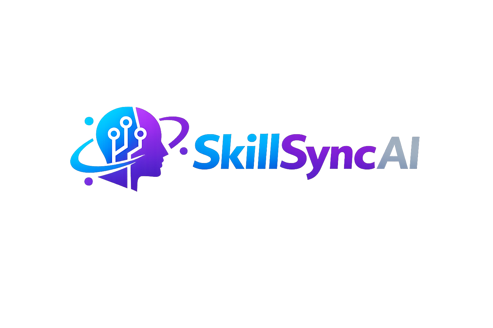

<div align="center">
	

# SkillSync AI

AI That Finds Work That Fits You


[Overview](#overview) • [Features](#features) • [Getting Started](#getting-started) • [Architecture](#architecture) • [Deployment](#deployment) • [Resources](#resources)
</div>

## Overview

SkillSync AI helps freelancers match with the right jobs faster. It combines a profile-driven scoring engine with optional AI insights to highlight why a job fits, what is missing, and how strong the match is.

## Features

- Profile-based scoring with explainable match insights
- Manual job import form for compliant data entry
- AI enrichment (Gemini or OpenAI) with deterministic fallback
- Search history and match tracking in Supabase
- Modular services for scraping, scoring, and insights

## Getting Started

1. Copy `.env.example` to `.env.local`.
2. Fill in Supabase credentials and configure either Gemini or OpenAI for AI insights.
3. Apply `supabase/migrations/001_initial_schema.sql` in Supabase SQL editor or through Supabase CLI.
4. Install dependencies with `npm install`.
5. Run the app with `npm run dev`.

For Gemini:

```env
AI_PROVIDER=gemini
GEMINI_API_KEY=your_gemini_key
GEMINI_MODEL=gemini-2.5-flash
```

For OpenAI:

```env
AI_PROVIDER=openai
OPENAI_API_KEY=your_openai_key
```

## Architecture

The codebase is structured as a modular monolith:

- `app`: routes, layouts, and API handlers
- `components`: reusable UI and dashboard features
- `services`: business logic for profile, search, scraping, matching, insights, and rate limiting
- `repositories`: persistence-only Supabase access
- `lib`: framework clients, validation, and config
- `types`: DTOs and domain types
- `utils`: pure helpers, error handling, logging, sanitization, and scoring

The scraper is behind a `JobScraper` interface so it can later move into a dedicated worker or be replaced by a compliant data provider.

## Deployment

- Deploy the Next.js app on Vercel or another Node-compatible platform.
- Set `SUPABASE_SERVICE_ROLE_KEY` in the deployment environment for server-side writes.
- Update Supabase Auth redirect URLs to include your production domain.

## Resources

- Supabase project settings and SQL migrations live in [supabase/migrations/001_initial_schema.sql](supabase/migrations/001_initial_schema.sql)
- Manual import fields accept Upwork links and auto-normalize them to full URLs
